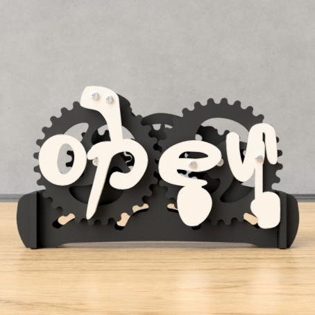
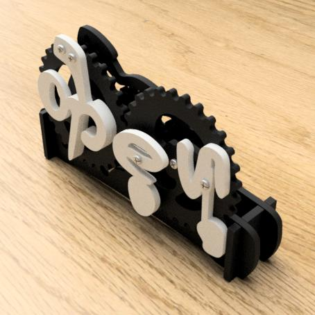
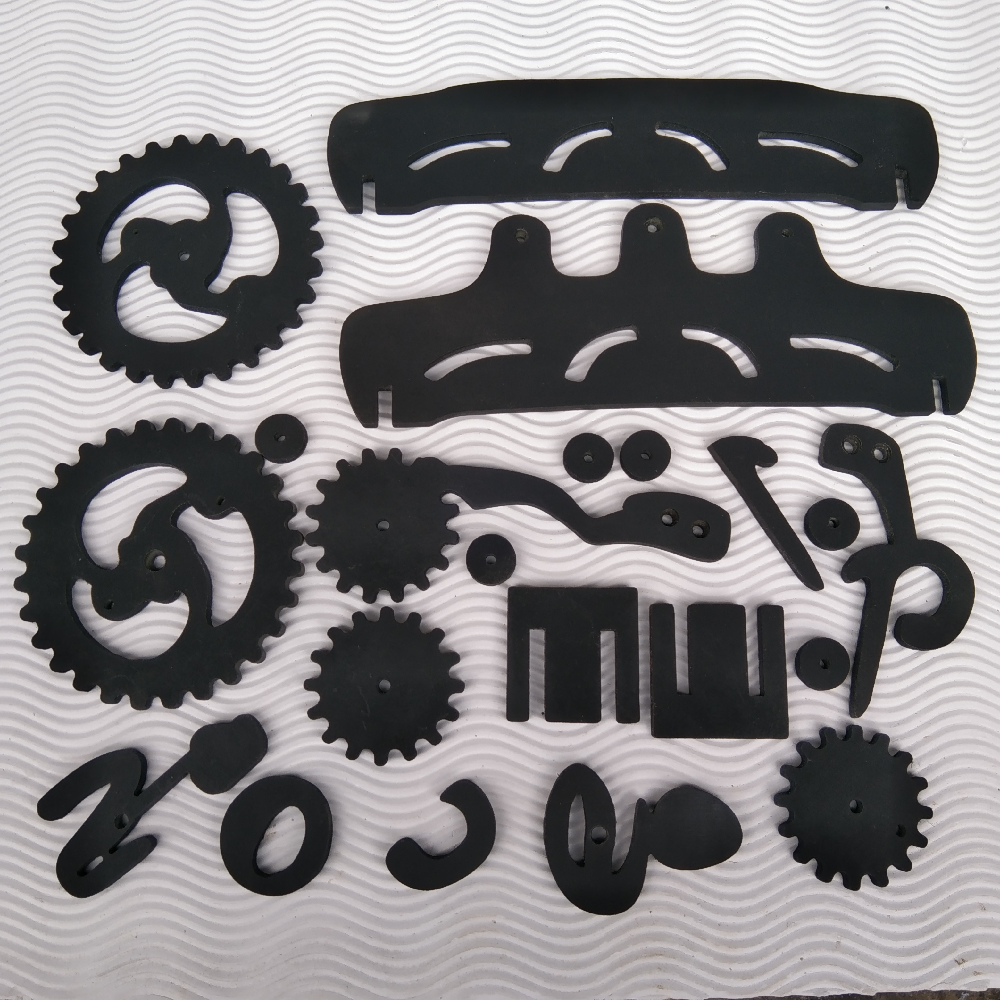
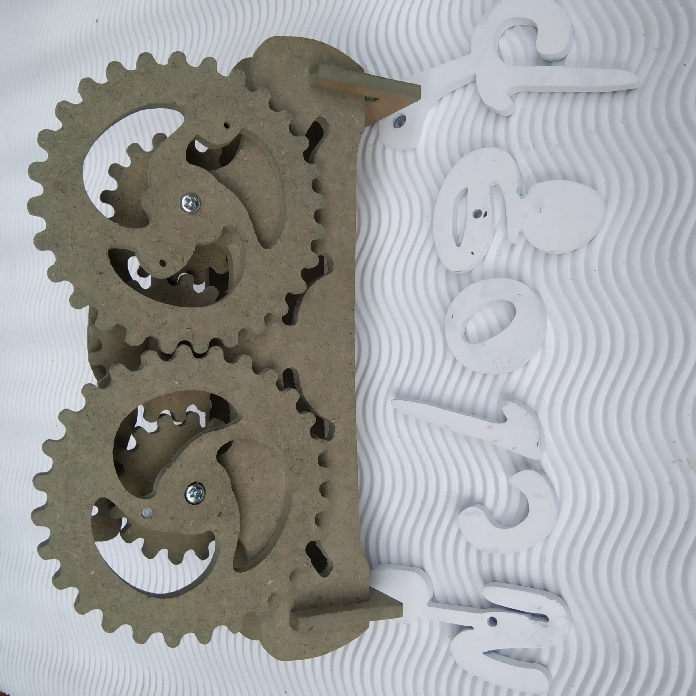

# CNC Router – Open/Closed Gear Sign

Digital Cutting Path File (G-code .nc)

This repository contains the digital CNC router files for creating a mechanical Open/Closed information sign driven by interlocking gears. The design is optimized for CNC routing and includes a pre-generated G-code (.nc) cutting program compatible with most CNC machines.

     

📌 Project Description

This project features a rotating gear-based display that switches between the words “open” and “closed.”
Each component—gears, lettering, frame, and linkages—is designed for smooth mechanical movement after assembly.

The cutting paths are exported directly into G-code (.nc) format, ready to load into CNC controllers.
An optional STL file is included for previewing or simulating the cutting operation.

📁 Included Files

G-code (.nc) – machine-ready cutting toolpath

STL model – for 3D visualization or toolpath simulation

Assembly reference image(s)

DXF/SVG (if applicable) – editable vector files

🛠 Recommended Materials

Wood / plywood

MDF

Acrylic sheet

PVC board

Suitable thickness ranges from 3 mm – 12 mm depending on the desired build.

⚙ CNC Settings (General Guidance)

Adjust according to your machine

Spindle: 10,000–18,000 RPM

Feed rate: 600–1500 mm/min

Cutting depth per pass: 1–3 mm

Endmill: 1.5–3 mm straight or spiral bit

🔧 Assembly Notes

Components are designed for screw or bolt fastening

Ensure gears rotate freely after cutting

Light sanding may improve movement and finish

Optional lubrication on pivot points

📘 Usage

This file is for:

Shops, cafés, studios → door signage

Workshops and offices

Decorative mechanical displays

CNC hobby and professional projects

📬 Support

If you need size adjustments, custom text, or a personalized mechanism, feel free to open an issue or submit a request.
